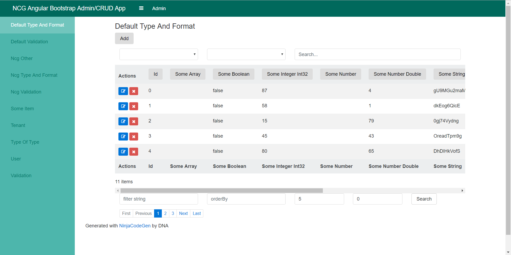

  <h4>Admin List View</h4>
  

### Quickstart

`npm install`

`npm start`

### Prerequisites
[Node.js](https://nodejs.org) and [Angular CLI](https://github.com/angular/angular-cli).

### Installing
Install Node.js from [https://nodejs.org](https://nodejs.org).

Install Angular CLI `npm install -g @angular/cli`

## Angular CLI
This project was generated with [Angular CLI](https://github.com/angular/angular-cli) version 1.0.0.

## Built-with
- [Bootstrap 4](https://v4-alpha.getbootstrap.com/)
- [ngx-bootstrap](http://valor-software.com/ngx-bootstrap/#/)
- [FontAwesome](http://fontawesome.io)

## Development server

Run `ng serve` for a dev server. 
 
## Code scaffolding
 
Run `ng generate component component-name` to generate a new component. You can also use `ng generate directive/pipe/service/class/module`.
 
## Build
 
Run `ng build` to build the project. The build artifacts will be stored in the `dist/` directory. Use the `-prod` flag for a production build.
 
## Running unit tests
 
Run `ng test` to execute the unit tests via [Karma](https://karma-runner.github.io).
 
## Running end-to-end tests
 
Run `ng e2e` to execute the end-to-end tests via [Protractor](http://www.protractortest.org/).
Before running the tests make sure you are serving the app via `ng serve`.
 
